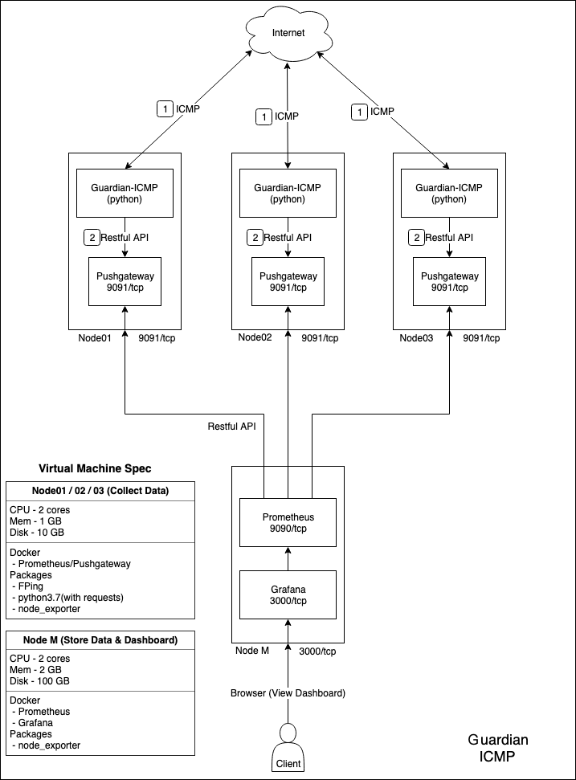
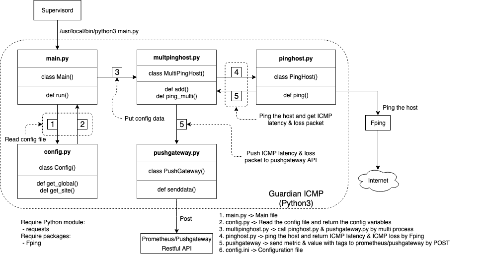

# Information
Get ICMP latency & ICMP packet loss by Fping and post data to prometheus/pushgateway.

# Configure
### Configure file
 - config.ini

### Global Config
 - [global]
   - fping_path - fping's path. (ex. /usr/local/bin/fping)
   - fping_count - ping the host how much count once. It's the same as 'fping -c{fping_count} {host}'
   - fping_interval - How often ping the host (seconds)
   - pushgateway_url - The pushgateway API domain+port (ex. localhost:9091)
   - job_name - The job name in prometheus instance
   - max_processes - The maximum of process by using fping to ping the host

### Site Config
 - Add host by this format:
~~~
[{Site_Name}]
host = {host_ip or Domain}
project = {Project_name}
tag = {Tag_Name}
~~~
 - Example:
~~~
[pchome]
host = www.pchome.com
project = project_test
tag = Taiwan
~~~

# Require packages
 - Fping4.2 ([offical web](https://fping.org/))
 - Python3.7.4 ([offical web](https://www.python.org/))

# Start the app
~~~
python3 main.py
~~~

# System structure

# Program structure

